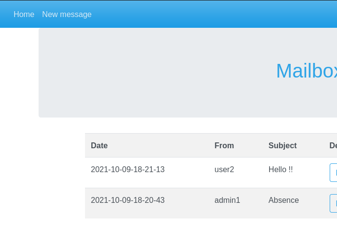
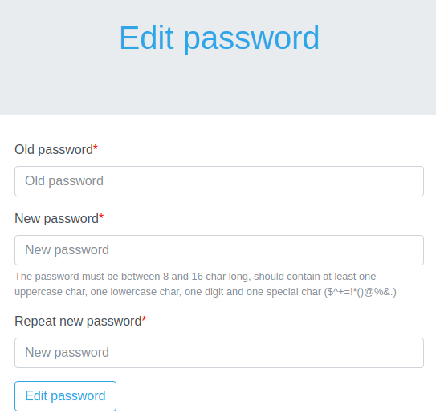

# STI - Projet 2 - Manuel

> Auteurs : Robin Gaudin - Lev Pozniakoff
>
> Date : 20.01.2022

## Installation

Afin de lancer l'application Web de messagerie, il faut tout premièrement lancer le script `launch_docker.sh` qui se trouve à la racine du projet. Le contenu du script:

```sh
# arrêt du container si il tourne déjà en arrière plan
docker stop sti_project
# suppression du container
docker rm sti_project
# téléchargement de l'image et lancement du container
docker run -ti -v "$PWD/site":/usr/share/nginx/ -d -p 8080:80 --name sti_project --hostname sti arubinst/sti:project2018
# exécution du service php
docker exec -u root sti_project service php5-fpm start
# exécution du service nginx
docker exec -u root sti_project service nginx start
# changement du propriétaire de la base de données
docker exec -u root sti_project chown -R www-data:www-data /usr/share/nginx/databases
```

Le script peut être lancé ainsi:

```sh
sudo chmod +x launch_docker.sh
./launch_docker.sh
```

Une fois le script exécuté, on peut directement se rendre sur la messagerie: `http://localhost:8080/`.

## Manuel d'utilisation

### Login

La première page de l'application est celle du login.


Il y a quatre utilisateurs disponibles afin de se connecter à la messagerie:

| Username | Password  | Rôle          | Validité |
| -------- | --------- | ------------- | -------- |
| admin1   | Admin$$$1 | admin         | actif    |
| admin2   | Admin$$$2 | admin         | actif    |
| user1    | User$$$1  | collaborateur | actif    |
| user2    | User$$$2  | collaborateur | inactif  |

### Lire les messages

Lorsqu'on se connecte à notre compte, nous pouvons directement lire tous nos messages.


On peut lire le message et voir les détails en appuyant sur le bouton `Details`:


### Répondre à un message

Ainsi on peut directement répondre au message en appuyant sur le bouton `Answer` soit dans la mailbox soit dans le détail du message.


Vu que c'est une réponse, il n'est pas possible de modifier le destinataire et le sujet du message. De plus, nous avons ajouté au sujet du message `RE:` afin de préciser qu'il s'agit d'une réponse.

### Suppression d'un message

Il est possible de supprimer un mail à l'aide du bouton `Delete` sur la page principale.


### Ecrire un message

On peut directement écrire un nouveau message en allant dans `New message`:



On peut donc choisir un destinataire parmi tous les utilisateurs et écrire un sujet et le contenu du message:


### Changement de mot de passe

Vous pouvez directement changer de mot de passe:


Il faut simplement entrer un nouveau mot de passe et le répeter une fois (le mot de passe doit contenir au moins une minuscule, une majuscule, un chiffre, un caractère spécial et doit faire entre 8 et 16 caractères):



### Logout

La déconnexion se fait dans le menu déroulant qui se trouve dans la barre de navigation, en haut à droite.

### Gestion d'un utilisateur

Un administrateur a la possibilité d'ajouter un utilisateur. Il peut le faire en allant dans `Add a user`


Il peut donc ajouter un utilisateur collaborateur ou adminisatreur et il peut aussi désactiver un utilisateur. 


Un administrateur peut également visualiser tous les utilisateurs existants en allant dans `Users` dans la barre du haut:


Il peut ainsi modifier un utilisateur ou le supprimer.

## Problèmes ?

Si vous n'arrivez pas à ouvrir l'application web, il est possible qu'un service de votre machine tourne déjà sur le port 8080. Vous pouvez modifier le port directement dans le script docker:

```sh
docker run -ti -v "$PWD/site":/usr/share/nginx/ -d -p 8081:80 --name sti_project --hostname sti arubinst/sti:project2018
```

En modifiant le port en `8081` (ou un autre port), il faut réexécuter le script et vous pouvez vous rendre sur l'application de messagerie sur: `http://localhost:8081/`.